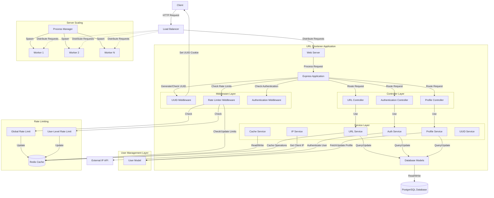

# SHORTLYCUT.XYZ

## Introduction

This project is a robust, scalable URL shortener backend service built with Node.js, Express, TypeScript, PostgreSQL, and Redis. It provides fast and efficient URL shortening and redirection services, with features like rate limiting and caching for improved performance and security.

## Architecture

The current architecture of the backend follows a microservices-inspired approach, utilizing multiple components to ensure scalability, performance, and reliability:

### Key Components:

1. **Nginx Load Balancer**: Distributes incoming traffic across multiple Node.js instances, handles SSL termination, and redirects HTTP to HTTPS.

2. **Node.js Cluster**: Utilizes all available CPU cores to handle requests efficiently.

3. **Express Application**: Handles HTTP requests, routing, and business logic.

4. **Rate Limiter**: Prevents abuse by limiting the number of requests from a single IP.

5. **URL Service**: Manages the creation and retrieval of shortened URLs.

6. **Redis Cache**: Stores frequently accessed data for quick retrieval.

7. **PostgreSQL Database**: Persistently stores URL mappings and associated data.

## How It Works

1. **URL Shortening**:
   - The client sends a POST request with the original URL.
   - The rate limiter checks if the request is within allowed limits.
   - The URL service generates a unique short ID.
   - The mapping is stored in both the database and cache.
   - The shortened URL is returned to the client.

2. **URL Redirection**:
   - The client sends a GET request with the short ID.
   - The system first checks the Redis cache for the original URL.
   - If not in cache, it queries the PostgreSQL database.
   - The user is redirected to the original URL.

3. **Clustering**:
   - In production, the application spawns multiple worker processes.
   - This allows the application to utilize all available CPU cores.
   - Nginx load balances requests across these worker processes.

## Redis Caching Strategy

Redis is used as a caching layer to improve performance:

1. **URL Caching**: 
   - Shortened URLs are cached in Redis for quick retrieval.
   - Cache entries have a TTL to ensure data freshness.

2. **Rate Limiting**: 
   - Redis is used to track and limit requests from each IP address.

3. **Cache Structure**:
   - Keys are structured as `shortId:longUrl` for URL mappings.
   - Rate limiting uses keys structured as `ratelimit_${ip}`.

## Optimization and Scaling

To handle more traffic and optimize performance:

1. **Database Optimization**:
   - Implement database replication for read scalability.
   - Use database connection pooling to manage connections efficiently.

2. **Caching Enhancements**:
   - Implement a distributed caching solution (e.g., Redis Cluster) for higher cache availability and scalability.
   - Fine-tune cache TTLs based on URL access patterns.

3. **Application-Level Optimizations**:
   - Implement request queuing for better handling of traffic spikes.
   - Use streams for processing large amounts of data.

4. **Infrastructure Scaling**:
   - Implement auto-scaling for the Node.js application based on traffic patterns.
   - Use a content delivery network (CDN) for serving static assets and caching redirects.

5. **Monitoring and Logging**:
   - Implement comprehensive logging and monitoring to identify bottlenecks and issues proactively.
   - Use tools like Prometheus and Grafana for metrics collection and visualization.

6. **Security Enhancements**:
   - Implement DDoS protection at the load balancer level.
   - Use a Web Application Firewall (WAF) for additional security.

7. **Containerization**:
   - Containerize the application using Docker for easier deployment and scaling.
   - Use Kubernetes for orchestrating and managing containers in a production environment.

By implementing these optimizations, the URL shortener backend can efficiently handle increased traffic loads while maintaining performance and reliability.

## Conclusion

This URL shortener backend is designed with scalability and performance in mind.

